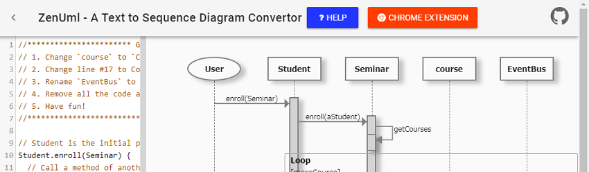
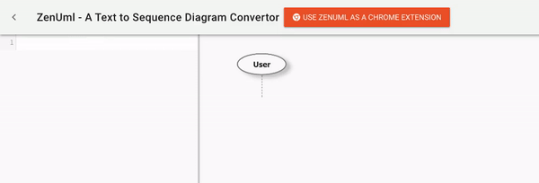
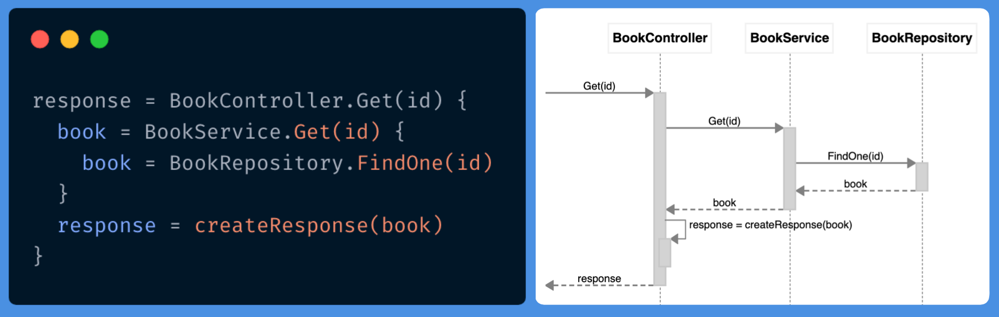
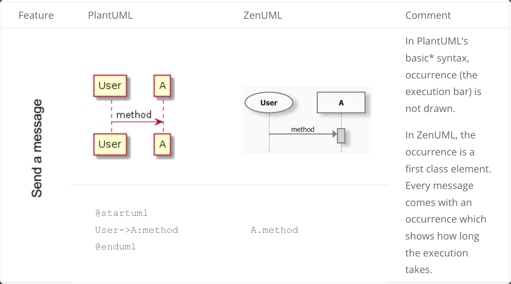
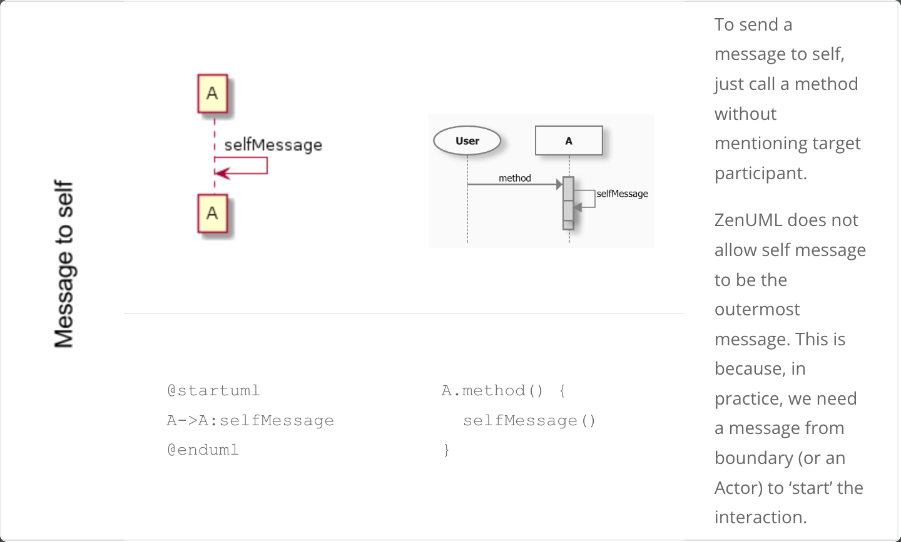
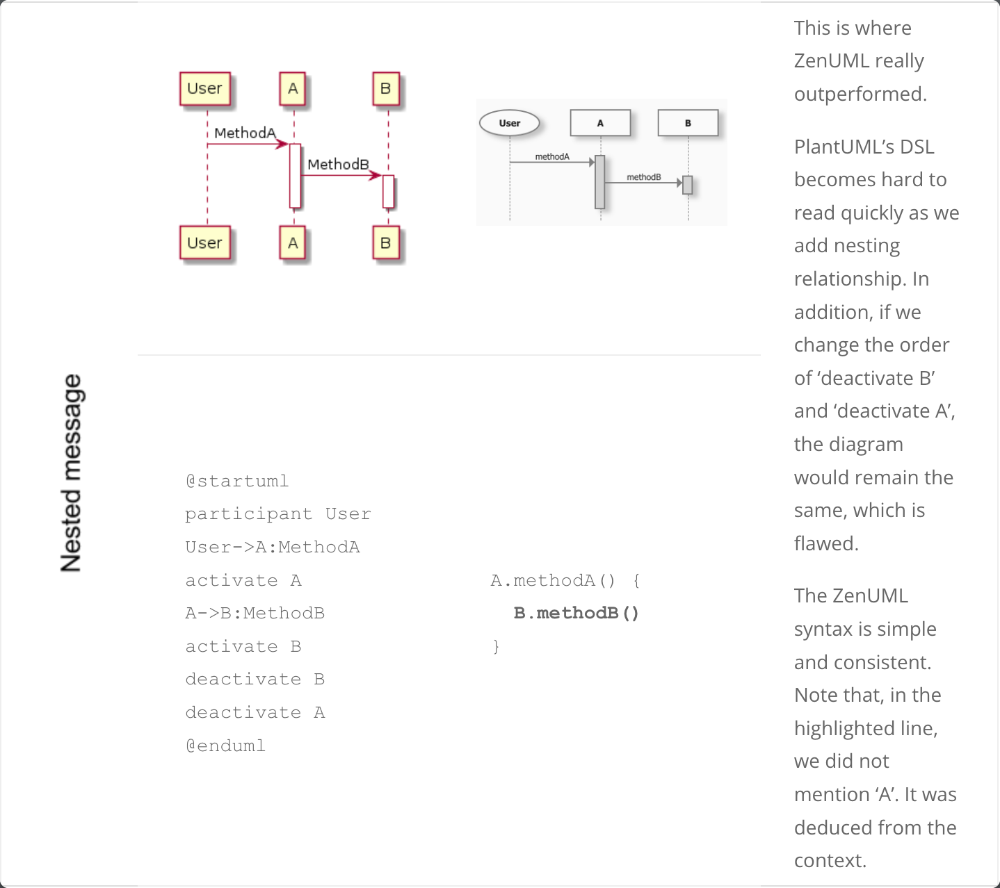
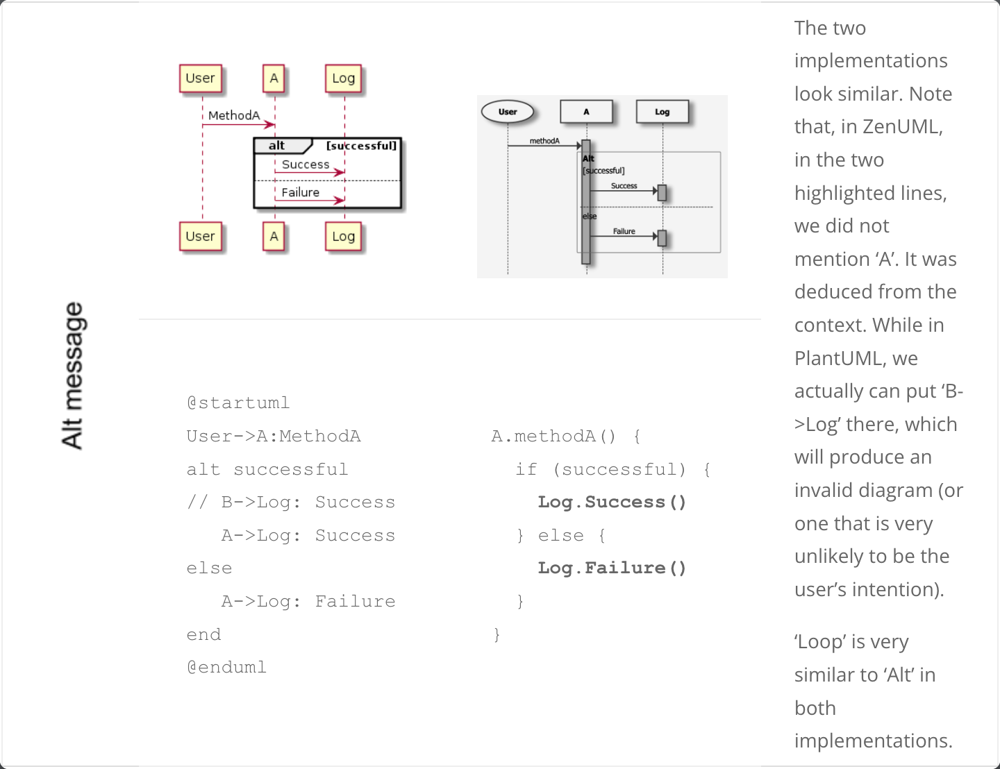

Hi all. I am Peng Xiao. I am the author of [ZenUML](https://zenuml.com/) – a [textual UML tool](https://modeling-languages.com/uml-tools/#textual) that takes markup text (DSL) and converts it into sequence diagrams. It is an honor for me to showcase the product here. If you would like to integrate it into your applications, please see the end.



## Why a new text to Sequence Diagrams tool?

The question I am often asked is: There is already [PlantUML](https://modeling-languages.com/interview-plantuml/) (and other tools) so why do you bother to build another one?.  In fact, some guy on reddit even [asked me to give up](https://www.reddit.com/r/programming/comments/77d6jg/try_catch_in_sequence_diagram/doky2e3/). Well, ZenUML at least is doing a better job in some cases. Read to see how they compare according to three dimensions: DSL, Feedback, Output.

[Watch Video Of PlantUML Demo](../../static/img/blog/2024/2024-01-01-02-plantuml-cropped.m4v)



## The DSL to define sequence diagrams in ZenUML

I started using sequence diagrams heavily around 2006. Since then, I have tried quite a few tools, including PlantUML. I like the idea of generating diagrams from text because I hate to constantly drag-and-drop and double-click to edit names etc. One thing I am not quite happy with PlantUML is its DSL. IMHO, it quickly gets unreadable when you start nesting logic as you can see in the above video. So I had to find a better way for presenting nesting logic: ‘{}’. It is widely used in the mainstream programming languages (sorry Python).

The following sequence diagram shows how a RESTful API might be implemented. Please note the DSL at the left-side. I hope most developers find it familiar enough.



For a full language reference, please go to [https://app.zenuml.com/help.html](https://app.zenuml.com/help.html).

### DSL comparison (PlantUML vs ZenUML)

For PlantUML users, I have prepared a table showing which features are implemented in ZenUML and the difference in the language. Note, ZenUML supports sequence diagram only (for now).






PlantUML supports occurrence with ‘activate/deactivate’ keywords.

Without doubt, PlantUML is a great tool good and has features (and a [huge ecosytem](https://modeling-languages.com/plantuml-textual-uml-online/) around) that ZenUML does not have.

However, what makes ZenUML unique is that it is an (opinionated) modelling tool. ZenUML enforces a valid model, while PlantUML allows you to draw anything. When there are more than two levels of nesting, PlantUML becomes hard to read, while ZenUML remains readable. For example, the following code, effectively, generates the same diagram:

> PlantUML

```
@startuml
participant User
User -> A: MethodA
activate A
A -> B: MethodB
activate B
B -> C: MethodC
activate C
deactivate C
deactivate B
deactivate A
@enduml
```

> ZenUML

```
A.methodA() {
  B.methodB() {
   C.methodC()
  }
}
```

## Output

While PlantUML produces diagrams as pictures (png, svg) and some other tools generate ASCII or draw on Canvas, ZenUML takes a different approach. It produces pure HTML DOM elements. The benefits are:

1.  You can apply any styles on it – different colors, borders, fonts and even handwritten styles.
2.  You still can produce images from it. This is already supported in the [Chrome Extension](https://chrome.google.com/webstore/detail/web-sequence/kcpganeflmhffnlofpdmcjklmdpbbmef).
3.  It is searchable. Participant names, messages are all text on the page. If you insert the diagram into another document, it is indexable.

## Feedback

PlantUML and most other tools have a ‘Submit’ (or ‘Refresh’) button. You have to click that button to get the resulting diagram. This is because they need to send the code to the backend server and get the picture back from the server. Websequencediagrams does not have the button, but it does a best-effort work to show the latest diagram. It is still far from being instant. As you can see in the GIF, ZenUML provides instant feedback to the user’s input. This is because all the conversion happens in the browser, no back-end request at all.

[Js-sequence-diagram](https://github.com/bramp/js-sequence-diagrams) is implemented in a similar way. There is a difference though. With Js-sequence-diagram, the whole diagram is re-rendered every time you type in a letter. It is kind of distraction. ZenUML is implemented with [VueJs](https://vuejs.org/). VueJs implements a Virtual DOM, and it only updates what you have changed (participant names, messages, etc.).

## A little bit of history and more

The first version of this tool was created in 2010 as a work for the first HTML5/CSS/JS competition in ThoughtWorks China. It was first implemented with drawing diagrams on Canvas. That version is still on [github](https://github.com/MrCoder/Simple-Sequence).

The source code for the website and Chrome Extension is also hosted on github ([site](https://zenuml.github.io/), [extension](https://github.com/ZenUml/web-sequence)). Feedback and/or pull request are welcome.

## Integration and license

It is super easy to integrate it to any web-based applications. You can find a demo project on [github](https://github.com/ZenUml/demo). If you need help, please drop me a mail at eagle.xiao(at)gmail.com.

All the pseudo code and generated diagram (in its HTML format and/or image format) are owned by the author of their corresponding source code (that is, their textual description in ZenUML language).
