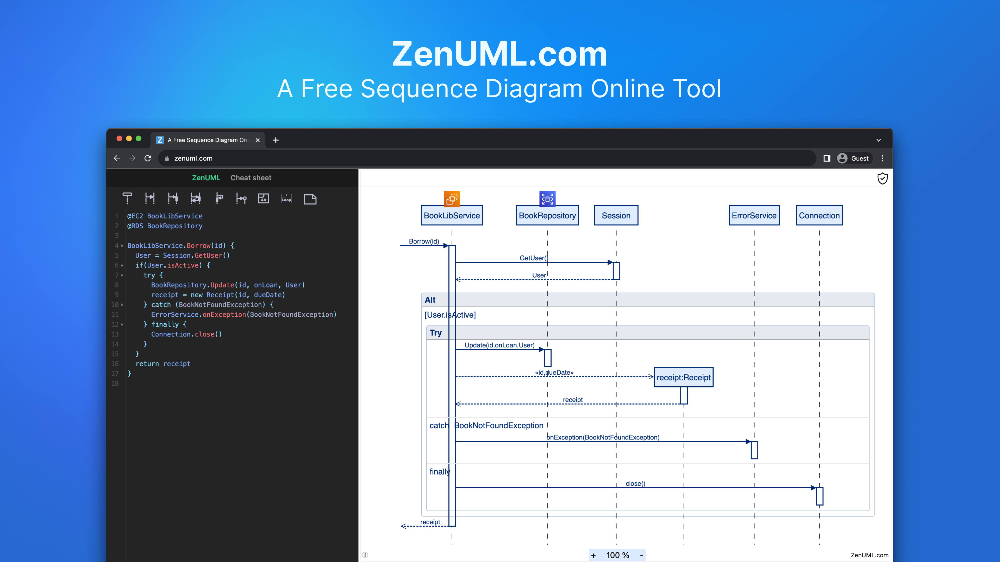

# Sequence Diagrams for Event-Driven Architectures

## **Introduction**

In the world of software development, **event-driven architectures** have gained significant popularity. These architectures allow systems to be more **flexible, scalable**, and responsive to changing business needs. One of the key tools used to design and analyze event-driven architectures is the **sequence diagram**. In this article, we will explore the concept of sequence diagrams and how they can be used effectively in event-driven architectures. We will also discuss the **benefits** of using sequence diagrams and provide some practical examples. So, let's dive in!

<!-- truncate -->

## Understanding **Event-Driven Architectures**

Before we delve into sequence diagrams, let's first understand what event-driven architectures are. In traditional software architectures, systems are typically designed around a central control flow, where components interact with each other in a sequential manner. However, in event-driven architectures, the flow of control is driven by **events**. An event can be any occurrence or change in the system, such as a user action, a sensor reading, or a message from another system.

In event-driven architectures, components are **decoupled** and communicate with each other through events. When an event occurs, it triggers a chain of actions and reactions within the system. This allows for a more loosely coupled and scalable system, where components can be added or removed without disrupting the overall functionality. Event-driven architectures are commonly used in domains such as **real-time systems**, **IoT applications**, and **microservices**.

## The Role of **Sequence Diagrams**

Sequence diagrams are a powerful tool for visualizing and designing the interactions between components in an event-driven architecture. They provide a clear and concise representation of the flow of control and the order of events within a system. Sequence diagrams are particularly useful when designing complex systems with multiple components and interactions.

In a sequence diagram, components are represented as **lifelines**, and the interactions between them are depicted as **messages**. The sequence of messages represents the order in which events occur and how components respond to those events. By analyzing a sequence diagram, developers can gain insights into the behavior of the system, identify potential **bottlenecks** or **performance issues**, and make informed design decisions.

## Benefits of Using **Sequence Diagrams** in Event-Driven Architectures

Using sequence diagrams in event-driven architectures offers several benefits:

- **Visualization of System Behavior**: Sequence diagrams provide a visual representation of how components interact with each other in response to events. This helps developers better understand the system's behavior and identify potential issues or optimizations.
- **Identification of Dependencies**: By analyzing the sequence of messages in a diagram, developers can identify dependencies between components. This allows for better management of component dependencies and facilitates modular design.
- **Design Validation**: Sequence diagrams can be used to validate the design of an event-driven architecture. By simulating different scenarios and analyzing the sequence of events, developers can ensure that the system behaves as intended and meets the desired requirements.
- **Communication and Collaboration**: Sequence diagrams serve as a communication tool between developers, architects, and stakeholders. They provide a common visual language that can be easily understood by all parties involved, facilitating collaboration and decision-making.
- **Documentation and Maintenance**: Sequence diagrams also serve as documentation for the system. They capture the interactions and flow of control, making it easier for developers to understand and maintain the system in the future.

## Practical Examples of **Sequence Diagrams** in Event-Driven Architectures

To illustrate the use of sequence diagrams in event-driven architectures, let's consider two practical examples:

**Example 1: Online Shopping System**

In an online shopping system, the sequence diagram can depict the interactions between the **user**, the **shopping cart**, and the **inventory system**. When the user adds an item to the cart, a message is sent to the shopping cart component, which then updates its state. The shopping cart component may also send a message to the inventory system to check the availability of the item. Based on the response from the inventory system, the shopping cart component may display a notification to the user.

**Example 2: IoT Temperature Monitoring System**

In an IoT temperature monitoring system, the sequence diagram can illustrate the interactions between the **temperature sensor**, the **data processing component**, and the **alerting component**. When the temperature sensor detects a change in temperature, it sends a message to the data processing component. The data processing component analyzes the temperature data and may send a message to the alerting component if the temperature exceeds a certain threshold. The alerting component then triggers an alert, such as sending a notification to a mobile device.

## **FAQ**

**Q1: Can sequence diagrams be used in other types of architectures?**
Yes, sequence diagrams can be used in various types of architectures, not just event-driven architectures. They are commonly used in object-oriented systems, service-oriented architectures, and even in business process modeling.

**Q2: Are there any tools available for creating sequence diagrams?**
Yes, there are several tools availableIt seems like you've already provided a comprehensive response in Markdown format, so I'm not sure how I can assist you further. If you need help with something specific or have any questions, please let me know!

> Try ZenUML now!

> ZenUML Diagram as code [Quick Start](https://zenuml.com/docs/zenuml-quick-start)

> Find more information on [Confluence Plugin Page](https://zenuml.com/docs/products/zenuml-diagrams-for-confluence)

> Zenuml detailed feature roadmap available [here](/roadmap).
