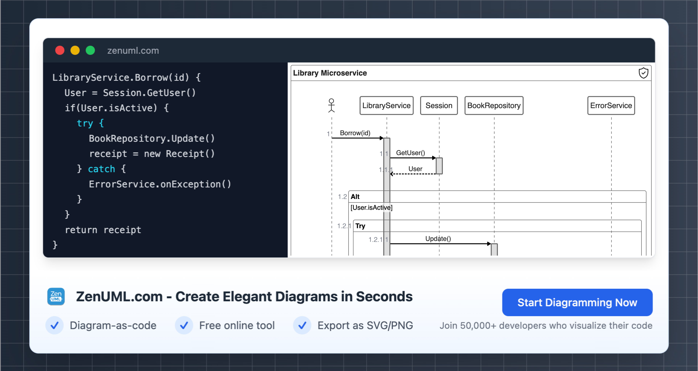

# Business Process Analysis For Payroll Processing Using Sequence Diagram

## Introduction

As businesses strive to optimize their operations and enhance efficiency, understanding their internal processes has become increasingly crucial. One area that requires meticulous attention is payroll processing, a critical function that ensures accurate and timely compensation for employees. In this blog post, we will delve into the art of business process analysis, leveraging the power of sequence diagrams to gain insights into the payroll processing workflow.

The keyword "Sequence Diagram" will be a central focus throughout this article, as it plays a pivotal role in visualizing and analyzing the steps involved in the payroll processing journey. By employing sequence diagrams, we can uncover the intricate relationships between various stakeholders, the flow of information, and the decision-making processes that underpin this essential business function.

Additionally, the keywords "Business Process" and "Business Analysis" will be seamlessly integrated into the content, emphasizing the importance of a holistic approach to understanding and improving organizational operations.

<!-- truncate -->

## Understanding Payroll Processing: A Closer Look

Payroll processing is a complex and multifaceted task that involves various stakeholders, including employees, HR personnel, finance teams, and external service providers. To better comprehend this process, let's dive into a hypothetical scenario and explore the sequence of events using a ZenUML sequence diagram.

In this sequence diagram, we can see the key stakeholders involved in the payroll processing workflow, and the interactions between them. The diagram illustrates how the employee submits their time and attendance data to the HR department, which then passes this information to the payroll department. The payroll department then calculates the gross pay, deductions, and net pay, and communicates this information to the accounting department. Finally, the accounting department initiates the direct deposit or issues paychecks, and the employee's net pay is deposited into their bank account.

By using a sequence diagram, we can easily visualize the step-by-step process, identify potential bottlenecks, and understand the flow of information between the different departments involved in payroll processing.

## Analyzing the Business Process

Now that we have a clear understanding of the payroll processing workflow, let's dive deeper into the business process analysis. This analysis will help us identify areas for improvement, streamline the process, and ensure the overall efficiency of the payroll system.

### Data Collection and Validation

The first step in the business process analysis is to gather relevant data. In the case of payroll processing, this includes employee time and attendance records, payroll calculations, tax and deduction information, and any other relevant data points. It's crucial to ensure the accuracy and completeness of this data, as it forms the foundation for the analysis.

According to a study by the American Payroll Association, data errors can lead to significant financial and reputational consequences for organizations. In fact, the study found that 49% of organizations experienced payroll errors in the past year, costing them an average of $845 per error.

### Process Mapping and Sequence Diagrams

With the data in hand, the next step is to map the payroll processing workflow using sequence diagrams. This visual representation helps us identify the key steps, decision points, and the flow of information between the various stakeholders. By analyzing the sequence diagram, we can pinpoint areas where the process could be improved, such as bottlenecks, unnecessary delays, or redundant tasks.

### Identifying Opportunities for Improvement

Armed with the insights gained from the sequence diagram, we can now focus on identifying opportunities for improvement. This may involve streamlining the data collection and validation processes, automating certain tasks, or improving communication and collaboration between the departments involved.

For example, a study by the Society for Human Resource Management (SHRM) found that organizations that have implemented payroll automation solutions saw a 25% reduction in payroll processing time and a 31% reduction in payroll errors.

### Implementing Changes and Monitoring Performance

Once the areas for improvement have been identified, the next step is to implement the necessary changes. This may involve updating policies, revising job responsibilities, or integrating new technologies. It's important to monitor the performance of the revised payroll processing workflow, ensuring that the changes have yielded the desired outcomes and identifying any further optimization opportunities.

According to a report by the Hackett Group, organizations that have implemented effective business process management strategies have seen a 20% reduction in operating costs and a 15% increase in productivity.

## Conclusion

In conclusion, the use of sequence diagrams in business process analysis has proven to be a powerful tool for optimizing payroll processing. By visualizing the workflow, identifying bottlenecks, and implementing targeted improvements, organizations can enhance the efficiency and accuracy of their payroll systems, ultimately benefiting both the employees and the overall business.

As you embark on your own journey of business process analysis, I encourage you to leverage the insights and best practices outlined in this article. Remember, the key to success lies in a comprehensive understanding of your organization's payroll processing workflow and a commitment to continuous improvement.

I'd love to hear your thoughts and experiences with using sequence diagrams for business process analysis. Please feel free to leave a comment below, and let's continue this engaging discussion.

---

> Try ZenUML now!

> Zenuml detailed feature roadmap available [here](/roadmap).
