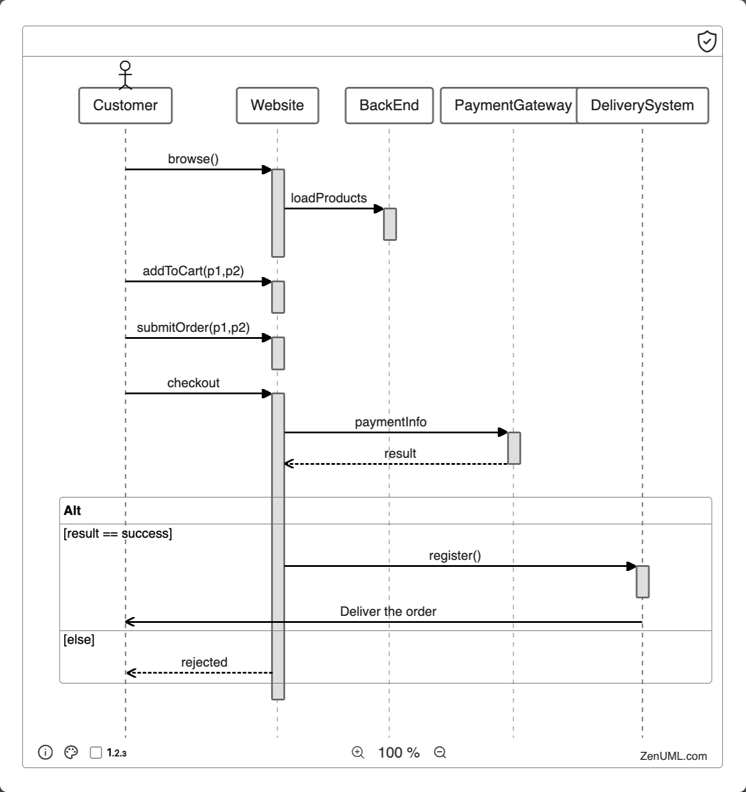

# What is the Online Shopping Sequence Diagram example?

Sequence diagrams hold notable significance in dynamic modeling as they elucidate the joint operation of a group of objects. They are extensively utilized in conjunction with UML (Unified Modeling Language) to depict a visually homogeneous procedure further employed to design a software system. This particular example models the logic behind a complex process - in this context, online shopping.



At the initial glance, it might seem that a rudimentary checkout flow can be executed with minimal effort. However, even the interactions that seem simplest at the outset necessitate an understanding of backend processes such as payment transaction and address authentication. Incorporate aspects like coupon codes, inventory control, and tracking details, and suddenly, a template becomes indispensable.

# Advantages of the Online Shopping Sequence Diagram Example

- Enable visualization of interaction among objects and components to finalize a process. Subsequently, delegate, refine, and discern requirements.
- Discover opportunities to optimize, thereby minimizing redundancy and conserving resources.
- Adapt the template to fit your specific use-case with ease. Not in need of an online shopping diagram? It has versatile applications ranging from food ordering to pet sitter booking.
- Incorporate data to personalize your diagram, ensuring that you're fully equipped before you initiate the process.
  C- ollaborate and share with distant colleagues to avail diverse perspective and maintain team cohesiveness.

# The Code

The above diagram is generated from the following code:

```
title Online shopping
@Actor Customer
Customer->Website.browse() {
  BackEnd.loadProducts
}
Customer->Website.addToCart(p1, p2) {
  BackEnd.updateCart
}
Customer->Website.submitOrder(p1, p2) {
  BackEnd.createOrder
}

Customer->Website.checkout(paymentInfo) {
  BackEnd.checkout(paymentInfo) {
    result = PaymentGateway.processPaymentInfo()
    updateOrder(result)
    if (result == success) {
      DeliverySystem.register()

      DeliverySystem->Customer: Deliver the order
    } else {
      return rejected
      @return Website->Customer: rejected
    }
  }
}
```
