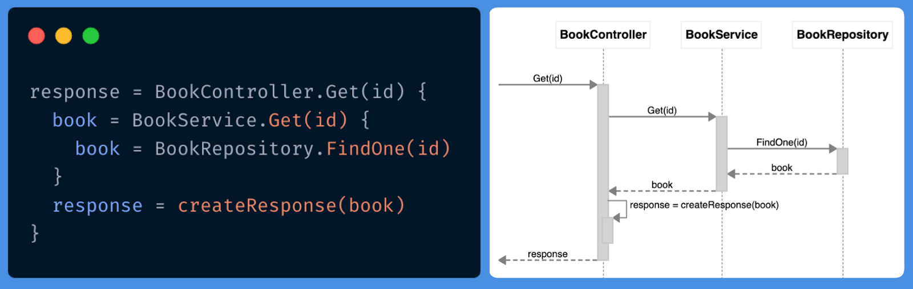
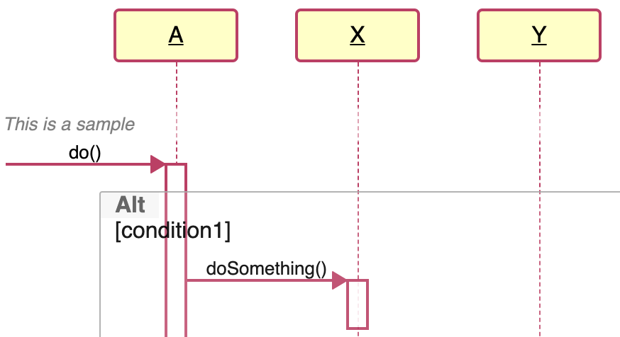
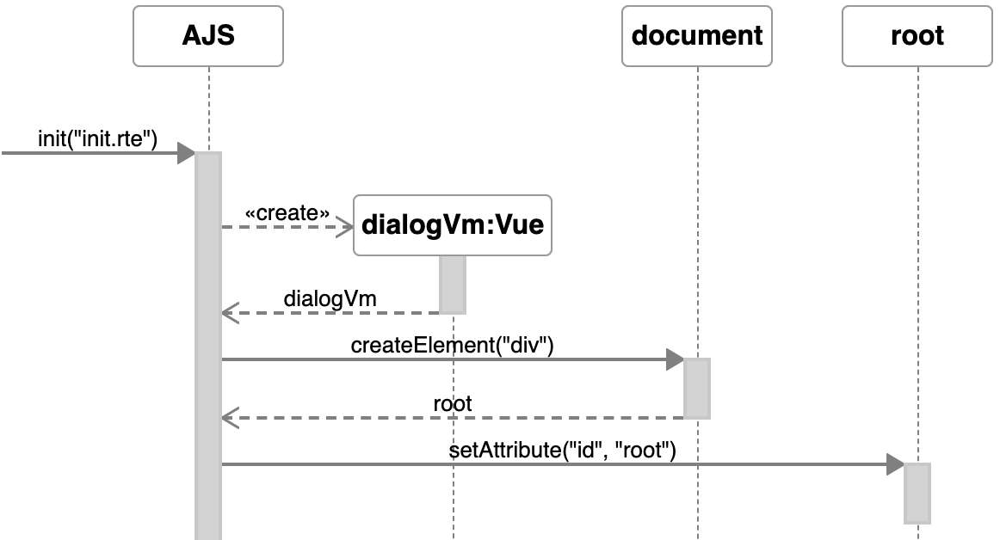
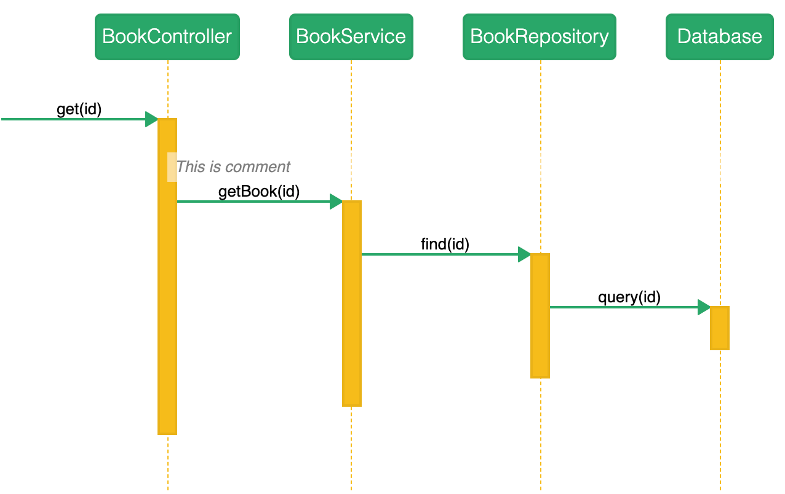

# Features

ZenUML is a sophisticated software modeler aimed to support agile and concise modeling with sequence diagrams.



## Diagram as Code

- Multi-platform support (Web, Atlassian confluence, VSCode, JetBrains etc), please find more information on [Products](/docs/products/)
- UML 2.x standard compliant
- Rapid drawing without drag-and-drop

## Export/Copy as Image

- We support **PNG** and PDF(on Confluence)

## Markdown in Comments

Markdown in comment will be rendered. Please checkout below example code.

```zenuml title=Loops
// `POST order`
//
// - [ ] Setup loadbalancer
// - [x] Config Kong gateway - [instrucions](document)
OrderController.create() {

  // Create an **immutable** order
  // - [ ] Build a microservice
  OrderService.create() {
    // | id | Prod_Name | Price | Inserted_At |
    // |----|-----------|-------|-------------|
    // |123 | book 1    | $10.00| 2020-06-30  |
    OrderRepo.save()
  }
}
```

## Customized Style

When using [ZenUML Web Editor](/docs/products/zenuml-online-editor), [ZenUML Chrome extension](/docs/products/zenuml-diagrams-chrome-extension) or [ZenUML Desktop](/docs/products/zenuml-desktop) you can define your own colors and styles by adding customized CSS.

Here is a few classic styles that you can start with:

### Traditional UML



```css
#diagram .sequence-diagram .lifeline .participant {
  font-weight: 400;
  border: 2px solid #b94065;
  background: #fffec8;
}
#diagram .sequence-diagram .lifeline .participant label {
  text-decoration: underline;
}
#diagram .sequence-diagram .lifeline .line {
  border-left-color: #b94065;
}
#diagram .sequence-diagram .message {
  border-bottom-color: #b94065;
}
#diagram .sequence-diagram .message svg polyline {
  fill: #b94065;
  stroke: #b94065;
}
#diagram .sequence-diagram .message.self svg > polyline:not(.head) {
  fill: none;
}
#diagram .sequence-diagram .occurrence {
  background-color: white;
  border: 2px solid #b94065;
}
```

### Light Modern



This style is achieved with only 4 lines of CSS.

```css
#diagram .participant {
  border: 1px solid;
  border-color: hsla(0, 0%, 0%, 0.4);
}
```

### Green-Orange



```css
#diagram .participant {
  border-radius: 5px;
  font-weight: 300;
  color: white;
  background: #27a768;
}

#diagram .lifeline .line {
  border-color: #f5bc1a;
}

#diagram .message {
  border-color: #27a768;
}

#diagram .message .fill svg.arrow polyline {
  fill: #27a768;
  stroke: #27a768;
}

#diagram .message svg.arrow polyline {
  fill: #27a768;
  stroke: #27a768;
}

#diagram .message.self svg.arrow polyline {
  fill: none;
}

#diagram .message.self svg.arrow polyline.head {
  fill: #27a768;
}

#diagram .occurrence {
  background: #f5bc1a;
}
```
