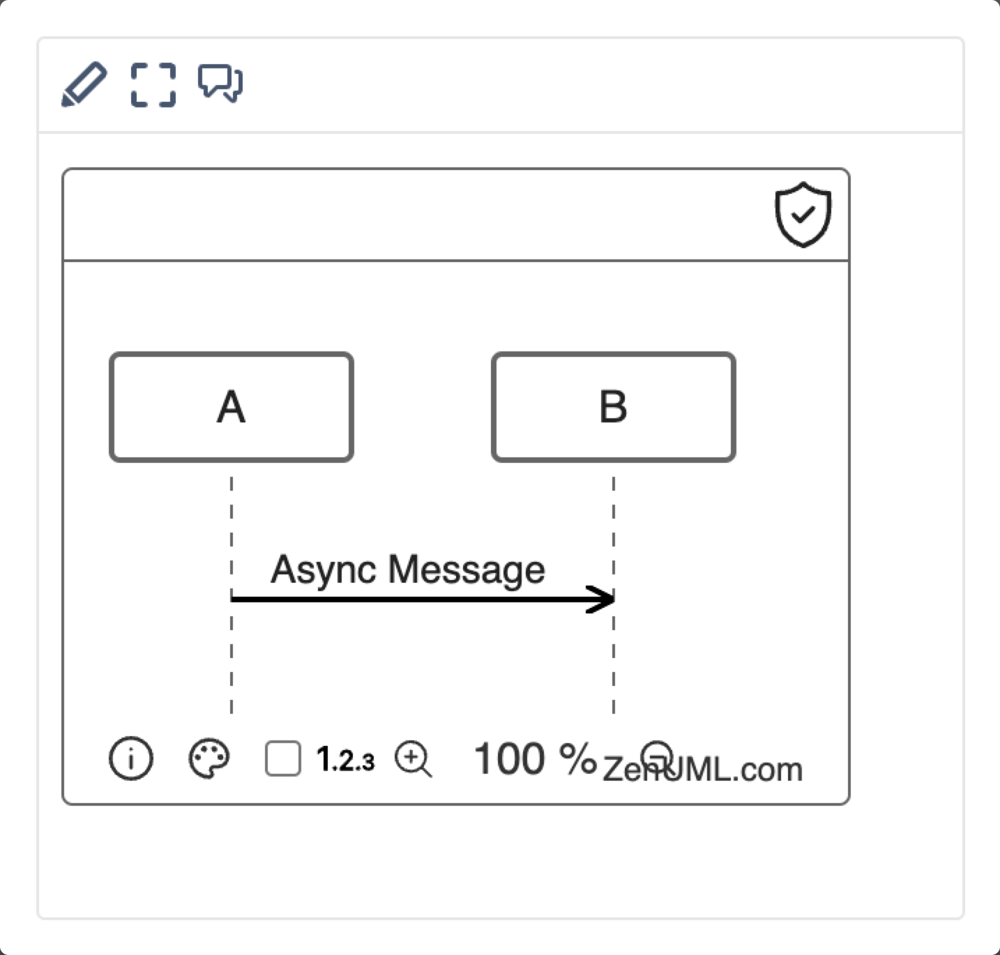
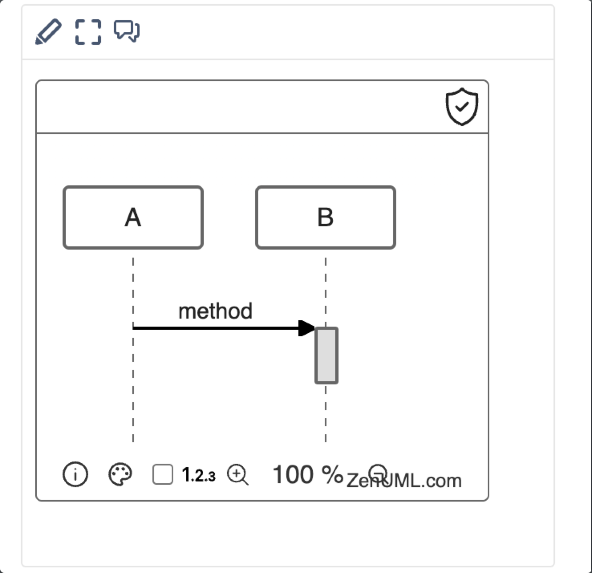
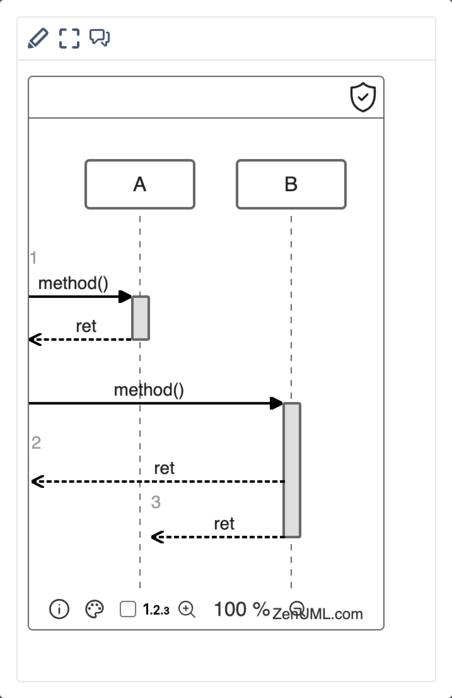
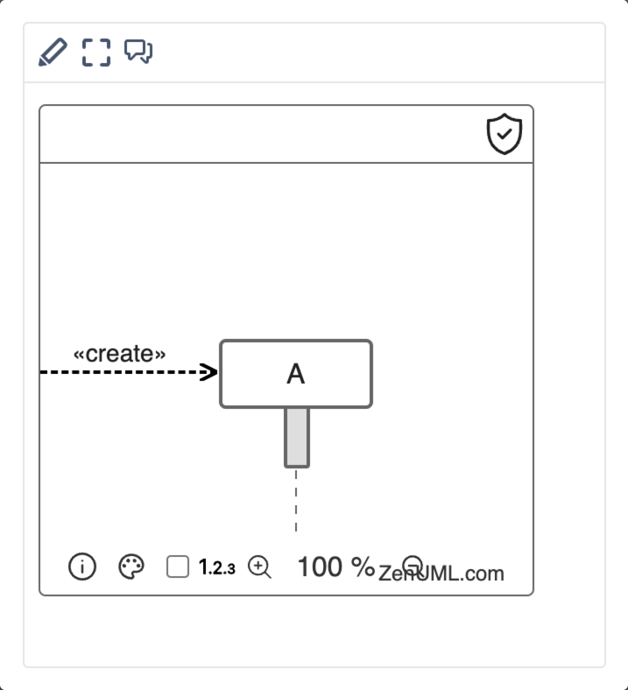

# Messages

## Message Definition

A message is shown as a line from the sender MessageEnd to the receiver MessageEnd.

> See Unified Modeling Language v2.5.1, section 17.4.4.1.

| Message type    | DSL                                                        | Line and arrowhead (Spec)                                                                       | Visualization                              |
| --------------- | ---------------------------------------------------------- | ----------------------------------------------------------------------------------------------- | ------------------------------------------ |
| Async           | A->B: Async message                                        | solid line with open arrowhead                                                                  |   |
| Sync            | A.method()                                                 | filled arrowhead                                                                                |    |
| Reply           | ret = A.method  return ret   @return A->B: message | dashed line with either an open or filled arrowhead  \* ZenUML renderer use open arrowhead. |   |
| Object creation | new ClassName()                                            | dashed line with an open arrowhead                                                              |  |
