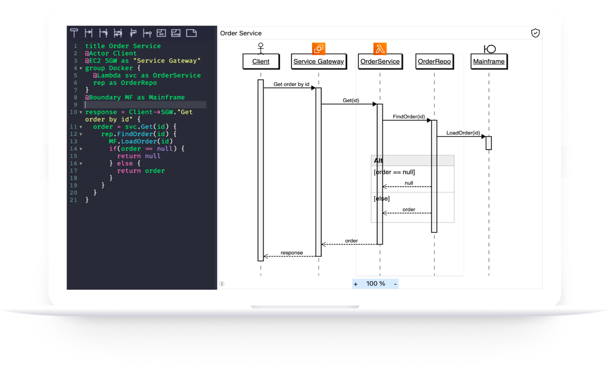

# What is ZenUML?

## Diagram As Code

**ZenUML** is a family of diagramming tools operated by P&D Vision Pty Ltd. It works on Atlassian Confluence, any modern browser, JetBrains Intellij IDE. It is featured as a leading diagram-as-code solution for sequence diagrams. Extra capabilities are provided on different platforms.

## Real Time Rendering

ZenUML renders the diagram in the browser with no overhead of server-sider interaction. The diagram is rendered in a near-real-time fashion. Your thought process is not interrupted by inefficient drag-and-drop or a slow loading animation.

## Interactions

The generated diagram is not just a static image. Users can interact with the diagram. For example, highlighting messages on the diagram will automatically select corresponding code in the editor in editing mode. This enables quick navigation in long and complex diagrams.
