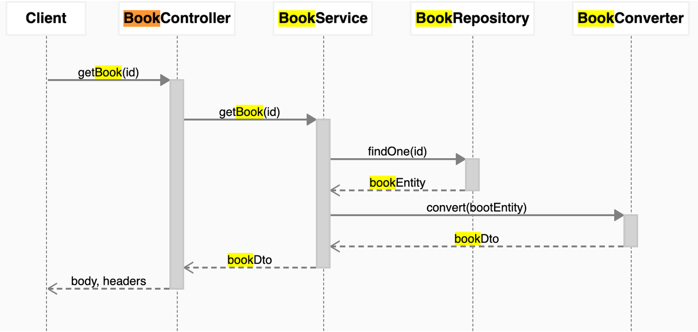

# ZenUML Diagrams For Confluence

## How to Use

### Installation

You can find the plugin landing page on:

[ZenUML Diagrams for Confluence(FREEMIUM) | Atlassian Marketplace](https://marketplace.atlassian.com/apps/1218380/zenuml-diagrams-for-confluence-freemium?hosting=cloud&tab=overview)

This add-on must be installed through the Atlassian Universal Plugin Manager (UPM):

1. Click on **Settings** on your Confluence Cloud instance
2. Click **Find new apps** from the left-hand side of the page
3. Locate **ZenUML Diagrams for Confluence (FREEMIUM)**
4. Click **Try it free** to install
5. Congratuations!

### Open / Create Diagrams

A ZenUML diagram/graph can be created within any Confluence page you have permission to edit.

**From the menu** **+↓**

You can also use the shortcut: **/zenuml**.

### Edit mode

Click the PEN icon below the macro to enter the edit mode.

### Save a diagram

When you finished editing, you can save the diagram by clicking the “Save” button. After saving a diagram, it can be edited at any time - click on the diagram, and then click on the PEN icon in the toolbar.

### View mode

In view mode, you can search on the diagram by using standard browser searching functionality.

## New Features

### Highlight Diagram Messages / Code

When you move the cursor in the code editor, the corresponding message will be highlighted; if you click a message in the diagram, the corresponding code will be highlight in the editor.

### Quick Toolbar

### ZenUML Graph

A new macro has been added to the ZenUML plugin. With this new macro you can draw any diagram you like. We are migrating text to digram feature to this new macro.

This macro is built on top of [mxgraph](https://jgraph.github.io/mxgraph/).

### Mermaid Diagrams

In the latest version, we have integrated mermaid into the plugin.

## Data Privacy and Security

We compliance with the [Atlassian security self-assessment](https://developer.atlassian.com/platform/marketplace/security-self-assessment-program/).

We do not store or access any of your data. ZenUML App is following a Serverless architecture style, **unlike** other products, all ZenUML diagrams are generated within browser using HTML (+SVG), JavaScript and CSS. The following diagram shows a high-level architecture of the Application.

We only collect usage data via Google analytics.

## Compliant with Standard

We have built-in our 20 years of experience in software development and architecture into ZenUML. The produced diagram is automatically standard compliant with [OMG UML(R) 2.5.1](https://www.omg.org/spec/UML/2.5.1/About-UML).
