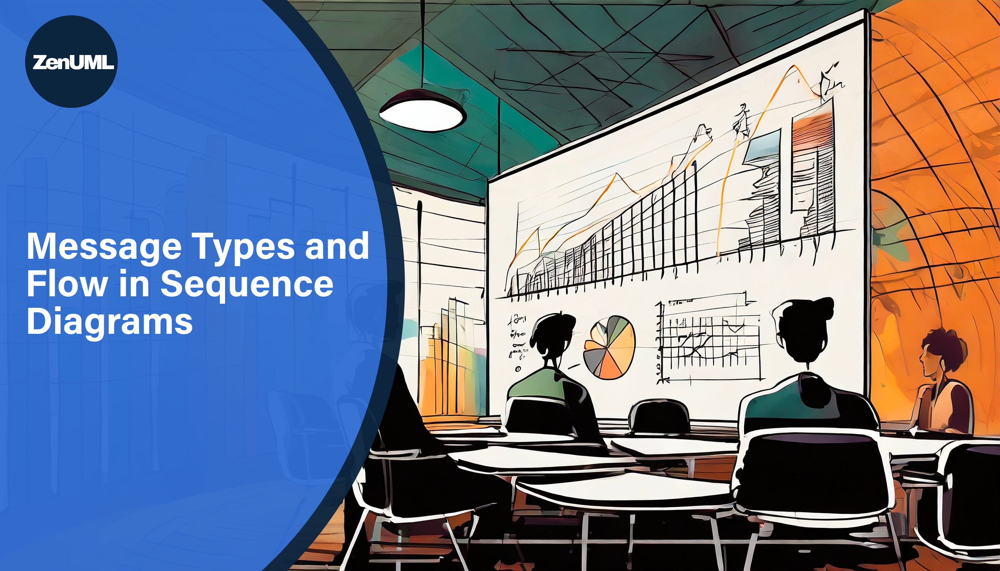

# Accurately Expressing Interactions: Message Types and Flow in Sequence Diagrams

Welcome back, tech enthusiasts! In our ongoing series on UML (Unified Modeling Language), we've already covered the basics and some advanced aspects of sequence diagrams. Today, we'll delve into the heart of sequence diagrams: the different types of messages and how they drive the flow of interaction between objects.

## Understanding Message Types

Sequence diagrams are all about communication, and the messages exchanged can be categorized into four main types:

### Synchronous Messages

A synchronous message represents a call from one object to another that requires a response before the calling object can continue. It's like making a phone call and waiting on the line for an answer. In sequence diagrams, synchronous messages are shown with a solid line and a filled arrowhead.

```zenuml title=Synchronous Messages
A -> B.method()
```

### Asynchronous Messages

Asynchronous messages are those where the sender does not wait for an immediate response. It's akin to sending an email; you continue with your life while waiting for a reply. These messages are depicted with a solid line and an open arrowhead, indicating a more free-flowing sequence of operations.

```zenuml title=Async message
A->B: Async message
```

### Return Messages

Every phone call should ideally end with a goodbye; similarly, in sequence diagrams, return messages are used to indicate that a response is being sent back to the caller, usually as a result of a synchronous message. These are shown with a dashed line and an open arrowhead.

```zenuml
ret = A.method
return ret
```

### Self Messages

Sometimes, an object needs to have a word with itself, triggering its own operations. These self-messages are represented with a bent arrow pointing back to the same object.

```zenuml title=Self Message: save(diagram)
FireWeb -> LaraSite.save(token, diagram) {
  save(diagram)
}
```

## The Importance of Message Ordering

Getting the order of messages right is crucial in sequence diagrams. It's the difference between a flawless dance routine and stepping on your dance partner's toes. To maintain this choreography, sequence diagrams are read from top to bottom. The vertical position of each message indicates the order in which they are sent.

## Representing Message Flow

To accurately depict the flow of messages, sequence diagrams use:

- **Lifelines**: These are vertical dashed lines that represent the existence of an object during the interaction.
- **Activation Bars**: Solid rectangles that show when an object is active or performing an operation.
- **Arrows**: As mentioned earlier, the direction and style of the arrow indicate the type of message and the flow of communication.

## Expressing Complex Interactions

Sequence diagrams truly shine when illustrating complex interactions. Here's how they handle complexity:

- **Loops & Conditionals**: For repeated or conditional flows, sequence diagrams use guards (square brackets) to denote conditions and loops.
- **Alternative Flows**: Using an "alt" frame, you can split the flow into multiple alternative paths, each with its own guard.
- **Ref Frames**: For simplifying complex sequences, a "ref" frame can call out to another sequence diagram, acting like a subroutine in programming.

**We will dive into more details in our next article.**

## Wrapping Up

By understanding the nuances of message types and their flow, you can leverage sequence diagrams to provide a clear and precise depiction of interactions within your system. Remember, a well-crafted sequence diagram is like a good conversation; it flows naturally, makes sense, and leads to effective understanding.

Until next time, happy diagramming!
