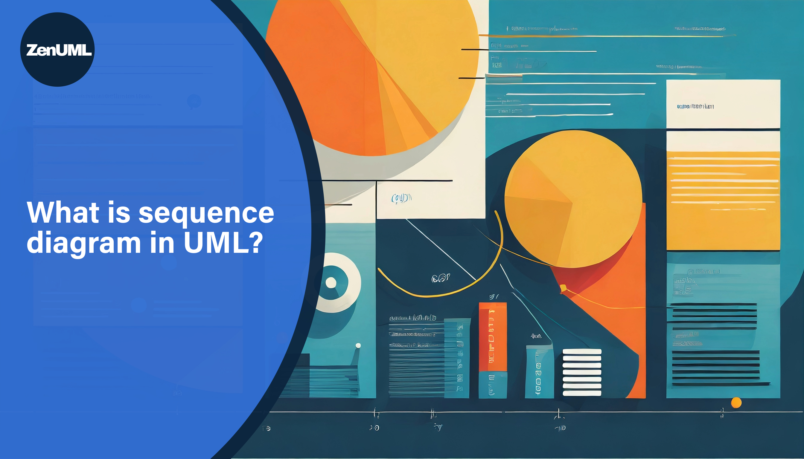
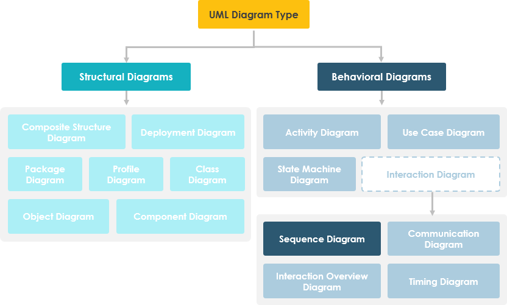

# What is a Sequence Diagram in UML?

Today, we're going to dive into the world of Unified Modeling Language (UML) and take a closer look at one of its most dynamic and informative diagrams – the sequence diagram. Whether you're a software engineer, a system analyst, or just someone with a love for structured visual representations, understanding sequence diagrams can be a game-changer. Let's unravel the mysteries of sequence diagrams together!

## Definition of Sequence Diagram

In UML, a sequence diagram is a type of interaction diagram that shows how objects interact in a given scenario of a business or a system. It's like a storyboard that illustrates the flow of operations, messages, or functions between different entities or objects over time. The sequence diagram captures the interaction between objects in the context of a collaboration.

Imagine you're watching a play, and you have the script that tells you who speaks to whom, in what order, and what happens as a result. That's what a sequence diagram does for a system's architecture! It details the sequential exchange of messages, events, and actions between objects.

## Benefits of Sequence Diagrams

Now, why should we bother using sequence diagrams? Here are a few compelling reasons:

- **Clarity**: They provide a clear sequence of interactions, making complex processes easy to understand at a glance.
- **Communication**: They serve as a fantastic communication tool among team members and stakeholders, ensuring everyone is on the same page.
- **Troubleshooting**: By laying out the sequence of events, they help identify potential issues and bottlenecks in the system's design.
- **Documentation**: They are an excellent means of documenting system behavior, which is crucial for future reference and maintenance.

## Use Cases for Sequence Diagrams

Sequence diagrams aren't just pretty pictures; they have practical uses across various stages of project development. Here's where they shine:

- **System Design**: During the design phase, sequence diagrams can be used to flesh out the details of how a new system will behave.
- **Requirement Analysis**: They help in understanding the requirements of a system by depicting how elements will interact to fulfill those requirements.
- **Code Validation**: Developers can use them to validate the logic of their code before diving into the nitty-gritty of coding.
- **Problem Solving**: When used to represent existing systems, they can help in pinpointing problems and finding solutions.

## ZenUML syntax and diagram components

Please find our [Language Guide](/docs/language-guide/) with examples. Go to [Quick Start](/docs/quick-start/) to dive into our diagraming experience.

## Bring more values

In fact, sequence diagrams are not only utilized within the realms of software development and architecture; they also play a pivotal role in describing value streams and business processes throughout the entire lifecycle of enterprise architecture and software development.

One of the beauties of sequence diagrams is their ability to evolve with the project. As the project grows, so can the diagrams, becoming more detailed and specific or being split into multiple diagrams for clarity.

In conclusion, sequence diagrams are more than just arrows and boxes on a page; they are a window into the dynamic dance of interactions that make up a system. Whether you're a seasoned pro or a curious newbie, understanding and using sequence diagrams can provide clarity and insight into your projects and organizations.
