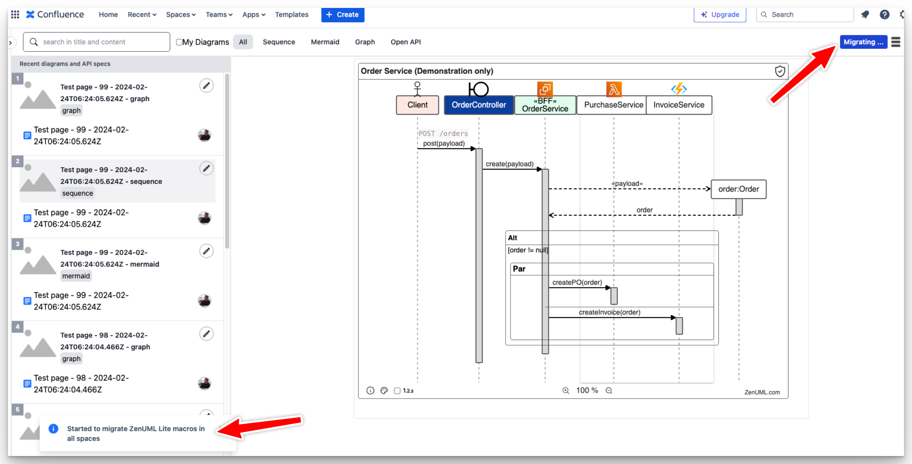

## Thank you! We appreciate your choice.

ZenUML Team appreciates your decision of upgrading from our Lite version to Full version. Here's the [Roadmap](https://zenuml.com/roadmap) of our full version product, the new features will be coming soon.

## **Why you need to migrate?**

All the diagrams in your confluence pages created from ZenUML Confluence Lite Version, can not be processed by new installed Full version. The data can not be processed cross different plugins unless the owner of the data(in this case, your organization) apply changes to transmit(we provided migration feature for you to easily do so).

If you want to keep all the old diagrams(macros) working as they are now, you will need follow below instructions to migrate the data.

> **You only need to do it once and we will support you during the process**.

## **Migration Instructions**

1. Install [ZenUML Diagrams for Confluence(FREEMIUM)](https://marketplace.atlassian.com/apps/1218380/zenuml-diagrams-for-confluence-freemium?tab=overview&hosting=cloud). Now you will have both Lite and Full version installed, stay this way untill you complete all the migrations.

2. [Submit Support Ticket](https://zenuml.atlassian.net/servicedesk) for requesting migration, we will enable the migration feature on your Lite version.

3. Login as your adminstrator. The account performs the migration need to have edit permission to all the zenuml macros you want to migrate in your site.
4. Click the ZenUML Lite app in the left panel

5. Click the “Migrate to Full” button

6. A popup message will be displayed indicating the migration is started. Do not leave the page while the migration is in progress.

7. Depending on the amount of content in the current Confluence space, it might take some time to complete the migration. When the migration is completed, another popup message will display the amount of migrated macros and pages:

8. You may uninstall your ZenUML Lite Version now.

## **In case of any unexpected situations**

> Please feel free to [Submit Support Ticket](https://zenuml.atlassian.net/servicedesk) or reach out to our support team via email support@zenuml.com, we will take care to make sure the transition smooth.

## **Known Limitatioins**

For confluence pages that is set with [Page Restrictions](https://confluence.atlassian.com/doc/page-restrictions-139414.html), even your site admin may not have access to these pages and the macros in the pages. Our migration function will not be able to reach and migrate these macros automatically. You may try either of below solutions:

- Manually grant access to all the restricted pages to your admin account, and do the same migration again. Confluence instructions can be found [here](https://confluence.atlassian.com/doc/page-restrictions-139414.html)
- Have your page owner to migrate these macros themselves, they can use the same migration button to do so.

---

Thank you for considering the upgrade. We're excited to welcome you to our Premium family and look forward to supporting your success!

[**Upgrade Now**](https://marketplace.atlassian.com/apps/1218380/zenuml-diagrams-for-confluence-freemium?tab=overview&hosting=cloud)
