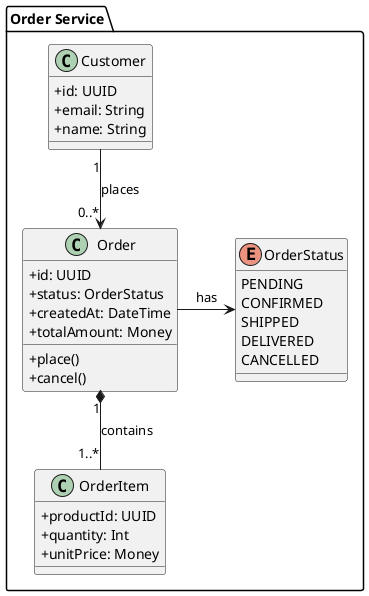

import Head from '@docusaurus/Head';

<Head>

</Head>

🌿 PlantUML  ·  Text-based UML  ·  Server-side rendering via plantuml.com

# PlantUML Diagrams in Confluence

Write PlantUML syntax directly inside a Confluence macro. Class diagrams, component diagrams, deployment, activity, state, and more — rendered by the public PlantUML service and stored as text on your page.

[⚡ Install Free — Lite Plan](https://marketplace.atlassian.com/search?query=zenuml+lite&hosting=cloud&product=confluence) · [All Diagram Types](/confluence/diagram-types/)

✓ Same syntax as your IDE plugins ✓ Rendered via the public plantuml.com service ✓ Version-controlled text diagrams

## What is PlantUML?

PlantUML is an **open-source, text-to-diagram tool** that converts a simple, human-readable syntax into rendered UML and non-UML diagrams. Instead of dragging shapes on a canvas, you describe participants, relationships, and flows in a plain-text block — PlantUML turns that description into a diagram image.

Because the source is plain text, PlantUML diagrams fit naturally into **software development workflows**: store them in Git alongside your code, review changes in pull requests, generate them in CI pipelines, and regenerate them automatically when your architecture changes. This is the approach that software architects and Java-ecosystem teams have been using for over a decade.

PlantUML supports a wide surface of diagram types — from precise UML artefacts like class diagrams and component diagrams to process-oriented views like activity and state diagrams. It is the go-to choice when a team wants a **single text syntax** that covers the full spectrum of UML without switching tools.

## Supported PlantUML Diagram Types

All major PlantUML diagram categories are supported. Write standard `@startuml … @enduml` blocks and the diagram renders live.

| Diagram Type | What it Shows | Typical Use |
|---|---|---|
| **Class** | Classes, interfaces, attributes, methods, and relationships (inheritance, composition, dependency) | Domain model, OOP design, API object hierarchy |
| **Component** | Software components, packages, interfaces, and their dependencies | System architecture, microservice topology, module structure |
| **Deployment** | Nodes, artifacts, and communication paths across infrastructure | Cloud deployment topology, infrastructure runbooks |
| **Activity** | Workflow steps, decision branches, parallel paths, and swim lanes | Business processes, CI/CD pipelines, on-call runbooks |
| **State** | States, transitions, guards, and entry/exit actions | Order lifecycle, auth flows, feature flag state machines |
| **Use Case** | Actors, use cases, and their relationships within a system boundary | Requirements documentation, stakeholder communication |
| **Entity Relationship** | Entities, attributes, and cardinality between database tables | Database schema documentation, data model overview |
| **Timing** | State changes on a shared time axis for multiple participants | Protocol timing, embedded system signal analysis |
| **Sequence** | Message exchanges between participants over time | API call flows, event-driven interactions |

## PlantUML in Action

The snippet below is a complete PlantUML class diagram. Paste it directly into the ZenUML macro editor — no modifications needed.

### Package grouping

The `package` keyword groups related classes into a named boundary — useful for bounded-context documentation and microservice domain maps.

### Relationship multiplicity

Arrow syntax expresses association (`-->`), composition (`*--`), and multiplicity labels (`"1"`, `"0..*"`) that map directly to UML 2.x semantics.

### Enums and typing

PlantUML supports `enum` alongside `class` and `interface`, so your full domain vocabulary — including state machines — appears in a single diagram.

## ZenUML DSL vs PlantUML for Sequence Diagrams

ZenUML for Confluence supports both syntaxes. Here is how they differ for sequence diagrams specifically — the diagram type where the choice matters most.

| Dimension | ZenUML DSL | PlantUML |
|---|---|---|
| **Syntax style** | Method-call notation — reads like code (`OrderService.placeOrder(cart)`) | Arrow notation — explicit message passing (`Client -> Server: placeOrder(cart)`) |
| **Conciseness** | More concise for multi-step API flows; nesting and return values implicit | More verbose; every arrow and return must be stated explicitly |
| **Readability for developers** | Familiar to developers — looks like function calls in any language | Familiar to architects and teams with prior PlantUML experience |
| **Diagram types** | Sequence diagrams only | Sequence plus eight other diagram types in the same syntax |
| **UML compliance** | OMG UML 2.5.1 compliant | UML 2.x aligned (community-driven) |
| **Best for** | Teams whose primary use case is API interaction documentation | Teams that document architecture across multiple UML diagram types |
| **IDE support** | ZenUML VS Code extension, IntelliJ plugin | PlantUML VS Code extension, IntelliJ PlantUML Integration (widely adopted) |

**Recommendation:** Use ZenUML DSL when your team's primary use case is sequence diagrams for API or service interaction documentation. Use PlantUML when your team already uses PlantUML in their IDE workflow and wants a single syntax for class, component, deployment, and sequence diagrams. Both are available in the same macro — you can mix and match across different Confluence pages.

## Who Uses PlantUML in Confluence

Five common scenarios where engineering teams reach for PlantUML inside Confluence.

### Architecture Decision Records

Software architects embed PlantUML component and deployment diagrams directly in ADR pages. When the decision changes, they update the text source and the diagram updates instantly — no stale PNG exports to hunt down and replace.

### Java Domain Model Documentation

Java and Kotlin teams generate class diagrams from their existing PlantUML IDE plugin annotations and paste them into Confluence. The same `@startuml` block that renders in IntelliJ renders identically in the ZenUML macro.

### Infrastructure Runbooks

SRE and platform teams use PlantUML deployment diagrams on runbook pages to show node topology, service dependencies, and communication paths — keeping the diagram in the same Confluence space as the on-call procedures.

### Business Process Documentation

Business analysts and product managers use PlantUML activity diagrams with swim lanes to model multi-team approval workflows, onboarding processes, and incident escalation paths — without needing access to a separate diagram tool.

### Database Schema Pages

Backend teams use PlantUML entity relationship diagrams on Confluence data-model pages. Schema changes are reviewed as text diffs in pull requests, then the updated PlantUML block is pasted back into Confluence to keep documentation current.

### Already using ZenUML DSL?

ZenUML DSL and PlantUML coexist in the same app. Use ZenUML DSL for your sequence diagrams and PlantUML for everything else — class, component, deployment, and activity diagrams. One Confluence macro, both syntaxes.

## Frequently Asked Questions

Common questions about PlantUML support in ZenUML for Confluence.

### What is PlantUML?

PlantUML is an **open-source, text-to-diagram tool** that converts a simple, human-readable syntax into UML and non-UML diagrams. You describe participants, classes, components, and their relationships in a plain-text block — PlantUML turns that description into a rendered diagram. Because diagrams are plain text, they can be stored in Git, reviewed in pull requests, and regenerated automatically when your system architecture changes. PlantUML has been widely adopted by Java developers, software architects, and teams across the JVM ecosystem for over a decade.

### What PlantUML diagram types does ZenUML for Confluence support?

- **Class diagrams** — classes, interfaces, attributes, methods, and UML relationships
- **Component diagrams** — software components, packages, and dependencies
- **Deployment diagrams** — nodes, artifacts, and infrastructure topology
- **Activity diagrams** — workflow steps, decision branches, and swim lanes
- **State diagrams** — states, transitions, and guards
- **Use case diagrams** — actors, use cases, and system boundaries
- **Entity relationship diagrams** — entities and database cardinality
- **Timing diagrams** — state changes on a shared time axis
- **Sequence diagrams** — message exchanges between participants

### How does PlantUML compare to ZenUML DSL for sequence diagrams?

- **ZenUML DSL** uses method-call notation that reads like code — more concise for multi-step API flows and developer-facing interaction docs.
- **PlantUML** uses arrow notation — explicit, familiar to teams with prior PlantUML experience, and consistent with the other eight PlantUML diagram types.

### Can I copy PlantUML code from my IDE into Confluence?

Yes. ZenUML for Confluence accepts the same **standard PlantUML syntax** that your IDE plugins produce — IntelliJ PlantUML Integration, the VS Code PlantUML extension, or any other tool that generates `@startuml … @enduml` blocks. Paste the source directly into the ZenUML macro editor and it renders immediately. There is no format conversion or image export step. The same source that renders in your IDE renders identically in Confluence.

### Does PlantUML render server-side or client-side in ZenUML?

PlantUML in ZenUML for Confluence renders **server-side**. Your PlantUML source code is sent to the public PlantUML render server at plantuml.com, which returns a rendered image that is then displayed on the Confluence page. This is how PlantUML rendering works in every Confluence integration — PlantUML's reference engine has no client-side/in-browser mode. Diagram source is stored as Confluence custom content — plain text, within your instance — but the render step itself leaves your Atlassian instance. Every other diagram type in ZenUML for Confluence (ZenUML sequence, Mermaid, DrawIO, OpenAPI) renders entirely in the browser; PlantUML is the one exception. Teams with strict data residency or confidentiality requirements should factor this in when choosing PlantUML over ZenUML DSL or Mermaid for sequence diagrams.

[View full FAQ →](/confluence/faq/)

## Add PlantUML to Your Confluence

Install ZenUML for Confluence and start writing PlantUML diagrams directly on your pages. Free Lite plan. No credit card. No external accounts. Installs in under two minutes.

### Install from Marketplace

Search for **"ZenUML"** on the Atlassian Marketplace. Choose Lite (free) or Full (paid). Admin permission required.

### Insert a ZenUML macro

On any Confluence page, type `/ZenUML` or use the macro picker. Select **PlantUML** as the diagram type in the macro dialog.

### Paste your PlantUML code

Paste your existing `@startuml … @enduml` block into the editor. The diagram renders live as you type. Click Publish to save.

[⚡ Install Lite — Free](https://marketplace.atlassian.com/search?query=zenuml+lite&hosting=cloud&product=confluence) · [Install Full — Paid](https://marketplace.atlassian.com/search?query=zenuml+confluence&hosting=cloud&product=confluence) · [All Diagram Types](/confluence/diagram-types/)

Used by engineering teams at Amazon, ThoughtWorks, and more.  |  Published by **P&D VISION** on Atlassian Marketplace.
