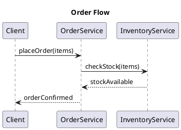

import Head from '@docusaurus/Head';

<Head>
<script type="application/ld+json">{`{"@context": "https://schema.org", "@type": "SoftwareApplication", "name": "ZenUML for Confluence — Sequence Diagrams", "alternateName": ["ZenUML Sequence Diagrams", "ZenUML DSL for Confluence"], "applicationCategory": "BusinessApplication", "applicationSubCategory": "Diagramming", "operatingSystem": "Atlassian Confluence Cloud", "url": "https://zenuml.com/confluence/diagram-types/sequence-diagrams/", "description": "ZenUML for Confluence lets engineering teams write sequence diagrams as code using ZenUML DSL — a concise, OMG UML 2.5.1-compliant text syntax that is 2-3x more concise than PlantUML. ZenUML DSL diagrams render entirely in the browser, live preview updates on every keystroke, and diagram source is stored as Confluence custom content. No content is ever sent to external servers for ZenUML DSL rendering. (PlantUML, which ZenUML for Confluence also supports as a separate diagram type, renders via the public plantuml.com service — see the PlantUML page for details.)", "featureList": ["ZenUML DSL — OMG UML 2.5.1 compliant sequence diagram syntax", "2-3x more concise than PlantUML for sequence diagrams", "Live preview — diagram updates on every keystroke", "Fully in-browser rendering — no server upload", "Actors, notes, groups (alt/loop/opt), and return arrows", "Export to PNG", "Version history via Confluence custom content", "Fullscreen split-pane editor", "AI-assisted syntax repair and title suggestions; Diagramly AI assistant on Full", "Copy source code with one click"], "offers": [{"@type": "Offer", "name": "Lite (Free)", "price": "0", "priceCurrency": "USD", "description": "Free plan — up to 100 diagrams per Confluence space."}, {"@type": "Offer", "name": "Full (Paid)", "description": "Unlimited diagrams. Available via Atlassian Marketplace subscription.", "url": "https://marketplace.atlassian.com/search?query=zenuml+confluence&hosting=cloud&product=confluence"}], "publisher": {"@type": "Organization", "name": "P&D VISION"}, "downloadUrl": "https://marketplace.atlassian.com/search?query=zenuml+lite&hosting=cloud&product=confluence"}`}</script>
<script type="application/ld+json">{`{"@context": "https://schema.org", "@type": "FAQPage", "mainEntity": [{"@type": "Question", "name": "What is ZenUML sequence diagram syntax?", "acceptedAnswer": {"@type": "Answer", "text": "ZenUML DSL is a text-based syntax for writing OMG UML 2.5.1-compliant sequence diagrams. Unlike PlantUML, which requires verbose arrow directives and participant declarations, ZenUML uses a call-expression style that mirrors how developers think about code execution: 'A -> B: method()'. A title, participants, messages, return arrows, notes, and combined fragments (alt, loop, opt, par) are all supported. The source is plain text stored in Confluence custom content and rendered in the browser via the ZenUML engine."}}, {"@type": "Question", "name": "How does ZenUML DSL compare to PlantUML sequence syntax?", "acceptedAnswer": {"@type": "Answer", "text": "ZenUML DSL is 2-3x more concise than PlantUML for sequence diagrams. PlantUML requires @startuml / @enduml delimiters, explicit participant declarations, and verbose arrow notation (A -> B: message). ZenUML infers participants from the messages you write, uses a cleaner arrow notation, and eliminates boilerplate. A four-message interaction that takes 10 lines in PlantUML takes 4-5 in ZenUML. Both syntaxes are supported by ZenUML for Confluence in separate macro types, so teams can migrate incrementally."}}, {"@type": "Question", "name": "Can I use Mermaid sequence diagrams in ZenUML for Confluence?", "acceptedAnswer": {"@type": "Answer", "text": "Yes. ZenUML for Confluence includes both a ZenUML DSL renderer and a full Mermaid.js renderer in the same app. To use Mermaid sequence diagram syntax, insert a ZenUML macro, choose the Mermaid diagram type, and write standard Mermaid sequenceDiagram code. Both diagram types coexist on the same Confluence page and are managed through the same macro interface. You do not need a separate Mermaid app."}}, {"@type": "Question", "name": "How do I document API flows in Confluence?", "acceptedAnswer": {"@type": "Answer", "text": "Insert a ZenUML macro on any Confluence page and choose the Sequence type. Write your API flow in ZenUML DSL — for example, 'Client -> OrderService: placeOrder(items)' followed by downstream service calls. The diagram renders live in the editor split pane. Publish the page and the diagram renders inline for all readers. For REST or GraphQL API contracts, use the OpenAPI macro type in the same app to render an interactive swagger-ui alongside the sequence diagram."}}, {"@type": "Question", "name": "Can I export sequence diagrams to PNG?", "acceptedAnswer": {"@type": "Answer", "text": "Yes. Every ZenUML sequence diagram can be exported to PNG directly from the diagram viewer in Confluence. Click the export button in the viewer toolbar and download the file. The export uses the in-browser rendered output, so what you export is exactly what viewers see on the page — no external service is involved. There is no separate PDF export from the app; Confluence's own page export (Word/PDF) includes a snapshot of the diagram as it appears on the page."}}, {"@type": "Question", "name": "Does ZenUML sequence diagram support actors, notes, and groups?", "acceptedAnswer": {"@type": "Answer", "text": "Yes. ZenUML DSL supports all major UML 2.5.1 sequence diagram constructs: named participants and actors, synchronous and asynchronous messages, return arrows (-->, dashed), self-calls, notes (left of, right of, over), and combined fragments including alt (alternatives), opt (optional), loop, and par (parallel). Participants are automatically inferred from messages unless explicitly declared. Nested groups are supported."}}]}`}</script>
</Head>


OMG UML 2.5.1 compliant  ·  2-3× more concise than PlantUML  ·  In-browser rendering

# Sequence Diagrams in Confluence with ZenUML

Write sequence diagrams as code directly inside Confluence using ZenUML DSL — a concise, standards-compliant text syntax. No image uploads, no external tools. The diagram renders in the browser in real time from the moment you type.

[Install Free — Lite Plan](https://marketplace.atlassian.com/search?query=zenuml+lite&hosting=cloud&product=confluence) · [See the syntax](#code-example)

✓ OMG UML 2.5.1 compliant ✓ 2-3× more concise than PlantUML ✓ Renders in-browser — zero server upload ✓ Free Lite plan — no credit card


## What is a ZenUML Sequence Diagram?

A ZenUML sequence diagram is an **OMG UML 2.5.1-compliant sequence diagram** written in **ZenUML DSL** — a concise text syntax designed specifically for sequence diagrams. Unlike generic UML tools that require a graphical editor, ZenUML lets you write diagrams the same way you write code: as plain text that you can version, diff, review in pull requests, and store alongside your source code.

Inside Confluence, ZenUML sequence diagrams live in a macro on the page. The source text is stored as **Confluence custom content** — it is part of your Atlassian instance, not an external service. On every page view the ZenUML engine (running entirely in the reader's browser) parses the DSL and renders the diagram as an SVG. No content is transmitted to ZenUML servers at any point.

ZenUML DSL models sequence diagrams as **call expressions** — the same mental model developers use when reading or writing code. Participants are inferred automatically from the messages you write, eliminating the boilerplate declarations that PlantUML requires. The result is diagrams that are typically **2-3× shorter** than equivalent PlantUML source while remaining fully UML-compliant.

## ZenUML DSL — a four-message order flow {#code-example}

Participants are inferred from message sources and targets. No declarations, no boilerplate. The `-->` arrow denotes an asynchronous or return message. Dashes render as a dashed line on the diagram.

```zenuml title="order-flow.zenuml"
title Order Flow

Client -> OrderService: placeOrder(items)
OrderService -> InventoryService: checkStock(items)
InventoryService --> OrderService: stockAvailable
OrderService --> Client: orderConfirmed
```

✓ 5 lines of source — no boilerplate ✓ Participants auto-inferred ✓ UML 2.5.1 compliant output

## How ZenUML DSL compares to PlantUML

Both syntaxes produce the same sequence diagram. ZenUML DSL removes the delimiter scaffolding, eliminates participant declarations (they are inferred), and uses a call-expression style that reads more like code. The result is typically 2-3× fewer lines for the same diagram.

**ZenUML DSL — 5 lines**

```zenuml
title Order Flow

Client -> OrderService: placeOrder(items)
OrderService -> InventoryService: checkStock(items)
InventoryService --> OrderService: stockAvailable
OrderService --> Client: orderConfirmed
```

- ✓ No `@startuml` / `@enduml` delimiters
- ✓ Participants inferred — no declarations needed
- ✓ Call-expression style mirrors code semantics

**PlantUML (equivalent) — 12 lines**



- ✗ Requires delimiter boilerplate
- ✗ Must declare every participant explicitly
- ✗ Spaces around `:` required; ordering sensitive

Note: ZenUML for Confluence also includes a [PlantUML renderer](/confluence/diagram-types/plantuml/) — teams can use both syntaxes in separate macros on the same page and migrate diagrams incrementally.

## When engineering teams reach for sequence diagrams

ZenUML sequence diagrams in Confluence appear wherever teams need to communicate interactions between actors, services, or systems — in design docs, runbooks, and onboarding guides.

### API Documentation

Show request-response flows for REST and GraphQL endpoints alongside the OpenAPI spec. Readers see both the formal contract and the runtime interaction sequence on the same Confluence page.

### Microservice Interactions

Document how services communicate across event queues, RPC calls, and HTTP APIs. Sequence diagrams make async handoffs and retry logic visible in architecture docs without a whiteboard session.

### User Flows

Map user interactions with a frontend through authentication, data loading, and state changes. Product managers and engineers share one artifact that lives in the Confluence design spec.

### System Architecture

Capture the dynamic view of a system alongside static architecture diagrams. Sequence diagrams explain the "how" that component diagrams leave implicit, and they age alongside the code as text in version history.

### Onboarding Flows

Walk new engineers through service boot sequences, auth handshakes, and dependency initialization. A sequence diagram in a Confluence runbook is faster to read than three paragraphs of prose.

### Incident Post-Mortems

Reconstruct a failure timeline as a sequence diagram in the post-mortem page. Show the exact order of calls, timeouts, and retries. The diagram persists in Confluence version history for future reference.

## Built for engineers who write diagrams as code

Every feature in the sequence diagram editor is designed to keep the diagram in sync with the code, the doc, and the team — without leaving Confluence.

### Live Preview

The rendered sequence diagram updates on every keystroke in the split-pane editor. No save cycle, no reload. Syntax errors are highlighted immediately, so you can correct them before publishing.

### PNG Export

Export any sequence diagram to PNG from the inline viewer toolbar. Share in Slack, include in slide decks, or attach to a Jira issue — without re-screenshotting. The export is pixel-exact to the on-page rendering. Need it in a PDF or Word doc instead? Confluence's own page export includes a snapshot of the diagram.

### Version History

Every publish creates a new Confluence custom content version. Browse previous states, restore an earlier diagram, and audit who changed what and when — using Confluence's native version history, with no extra tooling.

### Fullscreen Editor

Open any sequence diagram in a fullscreen split-pane modal directly from the Confluence page. Code on the left, rendered diagram on the right. Resize panes to focus on either the source or the output.

### Copy Source Code

Copy the ZenUML DSL source to clipboard with one click from the viewer. Store diagrams in a Git repository alongside source code, paste into another Confluence page, or share in a code review.

### AI Assistance

ZenUML for Confluence doesn't generate a diagram from a natural-language description inside the app — that capability lives in the separate diagramly.ai product. What's included: AI-assisted repair of broken ZenUML DSL syntax and AI-suggested diagram titles, plus the Diagramly AI assistant in the editor on the Full plan for additional AI help.

### Privacy-First Rendering

The ZenUML rendering engine runs entirely in the browser. Diagram source text — including confidential service names and API flows — is never transmitted to ZenUML servers. Suitable for air-gapped or strict data residency environments.

### Diagram as Code

Source is stored as plain text in Confluence custom content. Store a copy in Git alongside your service code. Diffs are human-readable. Updates take seconds when the architecture changes.

## Frequently Asked Questions

Common questions about ZenUML sequence diagrams in Confluence — syntax, comparison with other tools, export, and supported UML constructs.

### What is ZenUML sequence diagram syntax?

ZenUML DSL is a text-based syntax for writing **OMG UML 2.5.1-compliant sequence diagrams**. It uses a call-expression style that mirrors how developers think about code execution:

```zenuml
Client -> OrderService: placeOrder(items)
OrderService --> Client: orderConfirmed
```

Participants are inferred automatically from messages — no explicit declarations needed. Notes, combined fragments (alt, loop, opt, par), self-calls, and return arrows are all supported. The source is stored as plain text in Confluence custom content and rendered in the browser via the ZenUML engine.

### How does ZenUML DSL compare to PlantUML sequence syntax?

ZenUML DSL is **2-3× more concise** than PlantUML for sequence diagrams. PlantUML requires `@startuml` / `@enduml` delimiters, explicit `participant` declarations for every actor, and spaces around the colon separator. ZenUML infers participants from the messages you write and eliminates boilerplate. A four-message interaction takes 12 lines in PlantUML and 5 in ZenUML DSL. Both syntaxes are supported by ZenUML for Confluence in separate macro types, so teams can run both on the same page and migrate incrementally.

### Can I use Mermaid sequence diagrams in ZenUML for Confluence?

Yes. ZenUML for Confluence includes a full **Mermaid.js renderer** alongside the ZenUML DSL renderer — both in the same app. To use Mermaid sequence syntax, insert a ZenUML macro, choose the **Mermaid** diagram type, and write standard `sequenceDiagram` Mermaid code. The two diagram types coexist on the same page and are managed through the same macro interface. No separate Mermaid app is required.

### How do I document API flows in Confluence?

Insert a ZenUML macro on any Confluence page and choose the **Sequence** type. Write your API interaction in ZenUML DSL — for example:

```zenuml
title Order Flow
Client -> OrderService: placeOrder(items)
OrderService -> InventoryService: checkStock(items)
InventoryService --> OrderService: stockAvailable
OrderService --> Client: orderConfirmed
```

Publish the page and the diagram renders inline for all readers. For REST or GraphQL API contracts, pair the sequence diagram with the [OpenAPI macro](/confluence/diagram-types/openapi/) in the same app — interactive swagger-ui renders alongside the sequence diagram on the same Confluence page.

### Can I export sequence diagrams to PNG?

Yes. Every ZenUML sequence diagram can be exported to **PNG** directly from the diagram viewer in Confluence. Click the export button in the viewer toolbar and download the file. The export uses the in-browser rendered output — what you export is exactly what viewers see on the page. No external service or upload is involved at any step. There is no separate PDF export from the app; Confluence's own page export (Word/PDF) includes a snapshot of the diagram as it appears on the page.

### Does ZenUML sequence diagram support actors, notes, and groups?

- **Participants and actors** — named automatically from messages, or declared explicitly
- **Synchronous messages** — solid arrow (`->`)
- **Asynchronous / return messages** — dashed arrow (`-->`)
- **Self-calls** — a participant sending a message to itself
- **Notes** — over, left of, or right of a participant
- **Combined fragments** — `alt` (alternatives), `opt` (optional), `loop`, and `par` (parallel)
- **Nested groups** — fragments inside fragments

## Start writing sequence diagrams in Confluence — free

Install ZenUML Lite in under two minutes. No server setup, no external accounts, no credit card. The free Lite plan supports all diagram types including ZenUML sequence diagrams.

[Install Free — Lite Plan](https://marketplace.atlassian.com/search?query=zenuml+lite&hosting=cloud&product=confluence) · [Install Full — Paid](https://marketplace.atlassian.com/search?query=zenuml+confluence&hosting=cloud&product=confluence)

1 Find on Marketplace Search "ZenUML" on the Atlassian Marketplace and choose Lite or Full.

2 Click "Get it now" Select your Confluence Cloud site. Atlassian handles the install — no download needed.

3 Type /ZenUML on a page Insert the macro, choose Sequence, write your diagram, and publish.

Used by engineering teams at Amazon, ThoughtWorks, and more.  |  Published by **P&D VISION** on Atlassian Marketplace.  |  Rated 4.8★ on Atlassian Marketplace.
